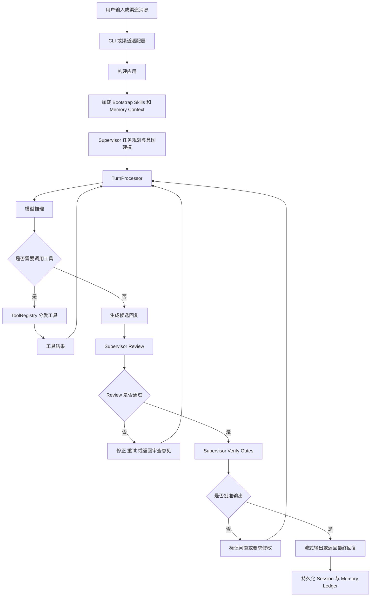

[English](README.md) | [中文](README.zh.md)

# Trustworthy Assistant

<div align="center">

[](https://www.python.org/downloads/)
[](https://opensource.org/licenses/MIT)

**一个支持记忆、流式输出和多通道接入的生产级 AI Agent 网关**

[功能特性](#-功能特性) • [快速开始](#-快速开始) • [安装](#-安装) • [文档说明](#-文档说明)

</div>

---

## 🚀 功能特性

### 核心能力
- ✅ **Agent Loop**: 以 `while True` + `stop_reason` 为基础的 agent 执行循环
- ✅ **工具调用**: 基于 schema 的工具声明与分发机制
- ✅ **会话与上下文**: 持久化会话，支持上下文溢出处理
- ✅ **网关与路由**: 多层绑定与会话隔离
- ✅ **智能层**: soul、memory、skills 与多层 prompt 组装
- ✅ **心跳与定时任务**: 支持主动任务和调度执行
- ✅ **可靠投递**: 带退避机制的消息处理能力
- ✅ **弹性容错**: 多层重试与恢复能力
- ✅ **并发控制**: 基于 lane 的串行化与 generation 追踪

### 增强特性
- 🎯 **流式输出**: 支持实时输出模型响应
- 🧠 **向量记忆**: 基于 embeddings 的语义检索能力
- 💬 **WeCom 机器人**: 支持企业微信机器人接入
- 🛡️ **Supervisor 工作流**: 内置 plan / execute / review / verify 流程

---

## 🏗️ 项目结构

```text
trustworthy_assistant/
├── src/
│   └── trustworthy_assistant/ # Python package
│       ├── channels/          # 多通道接入
│       │   └── wecom.py       # 企业微信集成
│       ├── memory/            # 可信记忆系统
│       │   ├── models.py
│       │   ├── repository.py
│       │   ├── retriever.py
│       │   ├── vector_store.py
│       │   ├── projector.py
│       │   └── service.py
│       ├── runtime/           # 运行时能力
│       │   ├── agents.py
│       │   ├── sessions.py
│       │   ├── turns.py
│       │   └── maintenance.py
│       ├── supervisor/        # 审核与验证工作流
│       │   ├── models.py
│       │   ├── policies.py
│       │   ├── reviewer.py
│       │   ├── gates.py
│       │   └── workflow.py
│       ├── providers/         # 模型提供方适配
│       │   └── normalization.py
│       ├── eval/              # 评估与回放
│       │   ├── benchmarks.py
│       │   └── replay.py
│       ├── app.py             # 应用入口工厂
│       ├── cli.py             # CLI 入口
│       ├── config.py          # 配置管理
│       └── run_wecom_bot.py   # WeCom 启动入口
├── workspace_template/        # 工作区模板
├── pyproject.toml             # 打包配置
├── README.md                  # 英文文档
├── README.zh.md               # 中文文档
└── .env.example               # 环境变量模板
```

### 执行流程



`supervisor` 主要在三个阶段起作用：
- 执行前：整理任务意图，建立 workflow 状态
- 草稿后：对结果进行 review，发现策略或质量问题
- 最终返回前：运行 verification gates，决定放行还是要求修正

---

## 📦 安装

### 从源码安装

```bash
git clone <your-repo-url>
cd trustworthy_assistant
python -m pip install -e .
```

### 环境要求
- Python 3.11+
- Anthropic 或兼容服务商的 API Key
- 可选: OpenAI API Key，用于更好的向量检索
- 可选: 企业微信凭证，用于 WeCom 机器人

---

## 🎯 快速开始

### 1. 初始化工作区

```bash
cp -r workspace_template workspace
```

### 2. 配置环境变量

```bash
cp .env.example .env
# 编辑 .env，填入你的 API Key
```

**必填配置**

```env
ANTHROPIC_API_KEY=sk-ant-xxxxx
MODEL_ID=claude-sonnet-4-20250514
```

**可选配置：向量记忆**

```env
OPENAI_API_KEY=sk-xxxxx
OPENAI_BASE_URL=https://api.openai.com/v1
EMBEDDING_MODEL=text-embedding-3-small
CHROMA_PERSIST_DIR=./chroma
```

**可选配置：企业微信机器人**

```env
WECOM_CORP_ID=wwxxxxxxxxx
WECOM_AGENT_ID=1000001
WECOM_SECRET=xxxxxxxxxxxxx
```

### 3. 启动 CLI

```bash
trustworthy-cli
# 或
python -m trustworthy_assistant.cli
```

请在仓库根目录下执行，并确保已经运行过 `python -m pip install -e .`。

### 4. 启动 WeCom 机器人

```bash
trustworthy-wecom
# 或
python -m trustworthy_assistant.run_wecom_bot
```

随后将企业微信 webhook 配置到 `http://your-domain:8000/wecom/webhook`。

---

## 📚 CLI 命令

```text
You > /memory stats         # 查看记忆统计
You > /memory list          # 列出记忆
You > /memory candidates    # 查看候选记忆
You > /memory trace         # 查看最近一次检索轨迹
You > /memory conflicts     # 查看冲突记忆
You > /memory confirm <id>  # 确认候选记忆
You > /memory reject <id>   # 拒绝候选记忆
You > /memory forget <id>   # 忘记一条记忆
You > /memory show <id>     # 查看记忆详情
You > /memory sync          # 同步 MEMORY.md 投影
You > /search <query>       # 搜索记忆
You > /prompt               # 查看完整系统提示词
You > /bootstrap            # 查看已加载 bootstrap 文件
You > /agents               # 列出 agent
You > /switch <agent_id>    # 切换 agent
You > /sessions             # 查看会话列表
You > /maintain             # 执行一次维护任务
You > /skills               # 列出技能
You > /benchmarks           # 运行 benchmark
You > /supervisor           # 查看 supervisor 状态
You > /review               # 查看最近一次 review
You > /verify               # 运行验证 gates
You > /workflow             # 查看 workflow 报告
You > exit                  # 退出 CLI
```

---

## 🧠 记忆系统

该项目的记忆系统采用 **ledger-based** 设计，并可选结合向量检索能力。

### 记忆状态流转

```text
candidate → confirmed → deprecated → archived
    ↓
  disputed（检测到冲突时）
```

### 混合检索

当前支持组合多种检索策略：
1. **关键词搜索**
2. **哈希向量检索**
3. **Embedding 向量检索**

---

## 💬 WeCom（企业微信）集成

### 配置步骤
1. 在企业微信后台创建自建应用
2. 获取 `Corp ID`、`Agent ID` 和 `Secret`
3. 将回调地址配置为 `https://your-domain:8000/wecom/webhook`
4. 将 token 设置为对应配置值

### 运行方式

```bash
trustworthy-wecom
```

---

## 🔧 文档说明

### Workspace 文件

系统会从 `workspace/` 目录读取以下 bootstrap 文件：

| 文件 | 作用 |
|------|------|
| `SOUL.md` | 个性与行为风格 |
| `IDENTITY.md` | 助手身份与角色定义 |
| `TOOLS.md` | 工具使用说明 |
| `USER.md` | 用户背景与偏好 |
| `MEMORY.md` | 长期记忆内容 |
| `HEARTBEAT.md` | 心跳与后台任务配置 |
| `BOOTSTRAP.md` | 额外启动上下文 |
| `AGENTS.md` | Agent 配置 |
| `CRON.json` | 定时任务配置 |

---

## 🛡️ Supervisor 工作流

内置 `Plan -> Execute -> Review -> Verify` 工作流，包含：
- **Rule-based Reviewer**: 基于策略规则的审查
- **Verification Gates**: 执行后的验证检查
- **Gate Decision**: 输出 approved / needs revision / rejected 等结果

---

## 🤝 贡献

欢迎贡献：

1. Fork 本仓库
2. 新建分支：`git checkout -b feature/amazing-feature`
3. 提交修改：`git commit -m 'Add some amazing feature'`
4. 推送分支：`git push origin feature/amazing-feature`
5. 发起 Pull Request

如果你的改动涉及行为变化，建议同步补充测试。

---

## 📄 许可证

本项目基于 MIT License 开源，详见 `LICENSE`。

---

<div align="center">
  <b>Made with ❤️</b>
  <br>
  <br>
  如果这个项目对你有帮助，欢迎点一个 ⭐️
</div>
